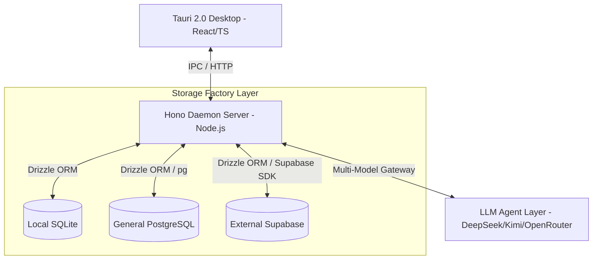

# 🪐 Jarvis | Personal AI Command Center

<div align="center">

**A secure, blazing-fast, and synced personal AI control layer. Built with Tauri 2.0 and Hono, unifying your conversations, tasks, readings, and daily memories into a single, cohesive interface.**

[](#-)
[](https://tauri.app/)
[](https://react.dev/)
[](https://hono.dev/)
[](https://www.typescriptlang.org/)
[](LICENSE)

[🌐 English Edition](./README.md) | [🇨🇳 简体中文](./README_zh.md)

</div>

---

## 👁️ Core Vision

**Jarvis** is more than just an AI assistant—it is the **unified brain** of your digital workspace. By tightly binding AI Tool Calling with your personal context databases, Jarvis bridges the gap between chat, task management, reading logs, and performance reviews.

Whether you prefer a zero-config, ultra-private **local-first experience**, or require seamless **cloud synchronization** across multiple devices, Jarvis's dynamic database-switching architecture accommodates your needs effortlessly.

---

## ✨ Features

- 🖥️ **Tauri 2.0 Powered**: An ultra-lightweight desktop client with near-zero memory footprint and gorgeous native OS window integration (featuring custom glassmorphism title bars).
- 🔀 **3-in-1 Storage Factory**:
  - **Local SQLite**: Zero-configuration, offline-first database keeping your data entirely in your hands.
  - **External Supabase**: Multi-device enterprise-grade cloud synchronization enabled in one click.
  - **General PostgreSQL**: Complete compatibility with AWS RDS, Neon.tech, Aiven, or any self-hosted PostgreSQL database.
- ⚡ **Hot-swapping & Online Migrations**: Seamlessly switch databases in real-time without restarting the client. Perform dynamic connection tests and automatically run DDL migrations to initialize all required database schemas in one click.
- 🧠 **Multi-Provider Stream Engine**: Native support for Server-Sent Events (SSE) streaming, context-aware tool invocation, and natural language command parsing. Fully compatible with **DeepSeek**, **Kimi**, **OpenRouter**, and other major LLMs.
- 🧹 **Windows Developer Daemon Utilities**: Built-in scripts to terminate zombie processes and release locked file resources, eliminating the typical `os error 5 (Access Denied)` locks on Windows systems.

---

## 🏗️ Architecture



---

## 📅 System Modules

| Module | Emojis | Core Description |
| :--- | :---: | :--- |
| **Chat** | `💬` | Conversational interface supporting streaming, contextual memory retrieval, and tool executions. |
| **Todo** | `📅` | Smart task manager supporting priority sorting, due dates, categories, and natural language creation. |
| **Reading** | `📖` | Curate and track your book/article queues with AI-generated abstracts and reading progress gauges. |
| **Review** | `📊` | Weekly/daily insights showing system metrics, task completion records, and automated review summaries. |
| **Database** | `🔧` | **Storage Control Panel**. Test connectivity, migrate schemas, and hot-swap storage engines instantly. |

---

## 🚀 Getting Started

### 📋 Prerequisites
- **Node.js**: `>= 20.0.0`
- **pnpm**: `>= 9.0.0`
- **Rust**: Latest stable Rust package manager (for Tauri compilation)

### 1. Clone & Install Dependencies
```bash
git clone https://github.com/your-username/Jarvis.git
cd Jarvis
pnpm install
```

### 2. Configure Environment Variables
Create a `.env` file in the root workspace (or copy `.env.example`):
```properties
# AI Configuration
AI_PROVIDER=deepseek
AI_MODEL=deepseek-chat
MIMO_API_KEY=your_key_here

# Daemon Port
DAEMON_PORT=3001

# SQLite Database Location
SQLITE_DB_PATH=./daemon/data/jarvis.db
```

### 3. Start Development Mode
```bash
pnpm dev
```
This command runs the **Hono Daemon Server** and the **Tauri Desktop Window** concurrently.

---

## 🛠️ Developer Utility Scripts

To resolve Windows file lock warnings (`os error 5: Access Denied`) when restarting builds, you can invoke the following root scripts:

* **Clean Desktop Client Zombie Processes**:
  ```bash
  pnpm clean:app
  ```
* **Release Backend Daemon Port (3001)**:
  ```bash
  pnpm clean:daemon
  ```
* **Clean Both (Recommended)**:
  ```bash
  pnpm clean:all
  ```

---

## 📂 Project Structure

```text
Jarvis/
├── daemon/               # Node.js backend supervisor (Hono framework)
│   ├── src/
│   │   ├── api/          # REST API endpoints
│   │   ├── db/           # Database persistent stores & Repository patterns
│   │   ├── config/       # Env validation schemas and persist config
│   │   └── index.ts      # Hono daemon launcher
│   └── data/             # Local SQLite binary location
├── frontend/             # Tauri 2.0 Webview Client (Vite + React)
│   ├── src/
│   │   ├── components/   # High-quality custom UI components (TitleBar, DbPage, etc.)
│   │   ├── stores/       # Zustand global stores
│   │   └── main.tsx      # React DOM bootstrap
│   ├── src-tauri/        # Rust source code
│   │   ├── icons/        # Automatic platform-adapted application icons (52 sizes)
│   │   └── src/lib.rs    # Tauri command registers and webview windows
│   └── public/           # Static asset served at web root
└── package.json          # Root Monorepo and pipeline clean configurations
```

---

## 📄 License

This project is licensed under the [MIT License](LICENSE).

---

<div align="center">

**🪐 Jarvis - Handcrafted to bring structure, elegance, and intelligence to your digital life.**

</div>
