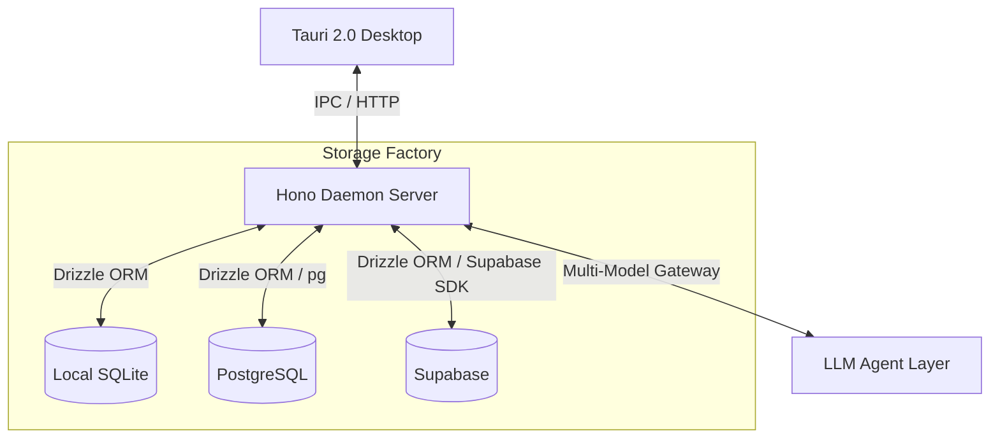

<div align="center">


# Jarvis

**Personal AI Command Center**

A secure, fast, and synced personal AI control layer built with Tauri 2.0 and Hono. Unifying conversations, tasks, readings, and daily memories into a single, cohesive interface.

[](https://tauri.app/)
[](https://react.dev/)
[](https://www.typescriptlang.org/)
[](LICENSE)

[English](./README.md) | [简体中文](./README_zh.md)

</div>

---

## Vision

Jarvis is more than an AI assistant — it is the **unified brain** of your digital workspace. By binding AI Tool Calling with personal context databases, Jarvis bridges the gap between chat, task management, reading logs, and performance reviews.

Whether you prefer a zero-config, private **local-first experience**, or seamless **cloud synchronization** across devices, Jarvis's dynamic database-switching architecture adapts to your needs.

## Features

**Tauri 2.0 Desktop** — Ultra-lightweight client with near-zero memory footprint and native OS integration.

**3-in-1 Storage Factory**
- Local SQLite — zero-config, offline-first, data stays in your hands
- External Supabase — one-click multi-device cloud sync
- General PostgreSQL — compatible with AWS RDS, Neon.tech, Aiven, or any self-hosted instance

**Hot-swapping & Online Migrations** — Switch databases in real-time without restarting. Run DDL migrations automatically.

**Multi-Provider Stream Engine** — SSE streaming, context-aware tool invocation, natural language parsing. Supports DeepSeek, Kimi, OpenRouter, and any OpenAI-compatible provider.

**Model Marketplace** — Dynamic provider registration with preset catalog (OpenAI, Anthropic, Google, DeepSeek, Groq, Qwen, OpenRouter, Ollama). Add any custom OpenAI-compatible endpoint via UI.

## Architecture



## Modules

| Module | Description |
|:---|:---|
| **Chat** | Streaming conversation with contextual memory and tool execution. |
| **Todo** | Smart task manager with priority, due dates, tags, and natural language creation. |
| **Reading** | Book/article tracking with AI-generated abstracts and progress gauges. |
| **Review** | Daily/weekly insights with completion metrics and automated summaries. |
| **Database** | Storage control panel — test connectivity, migrate schemas, hot-swap engines. |
| **Models** | Model marketplace — manage providers, discover models, configure routing rules. |

## Getting Started

### Prerequisites

- Node.js >= 20.0.0
- pnpm >= 9.0.0
- Rust (latest stable, for Tauri)

### Install

```bash
git clone https://github.com/your-username/Jarvis.git
cd Jarvis
pnpm install
```

### Configure

Create `.env` in the root (or copy `.env.example`):

```properties
AI_PROVIDER=deepseek
AI_MODEL=deepseek-chat
MIMO_API_KEY=your_key_here
DAEMON_PORT=3001
SQLITE_DB_PATH=./daemon/data/jarvis.db
```

### Run

```bash
pnpm dev
```

Starts the Hono daemon and Tauri desktop window concurrently.

## Developer Scripts

For Windows file-lock issues (`os error 5: Access Denied`):

```bash
pnpm clean:app     # Kill desktop client zombie processes
pnpm clean:daemon   # Release port 3001
pnpm clean:all      # Both (recommended)
```

## Project Structure

```
Jarvis/
├── daemon/               # Node.js backend (Hono)
│   ├── src/
│   │   ├── api/          # REST API endpoints
│   │   ├── db/           # Database stores & repository pattern
│   │   ├── config/       # Env validation & persistent config
│   │   └── index.ts      # Entry point
│   └── data/             # Local SQLite storage
├── frontend/             # Tauri 2.0 client (Vite + React)
│   ├── src/
│   │   ├── components/   # UI components
│   │   ├── stores/       # Zustand state management
│   │   └── main.tsx      # React entry
│   ├── src-tauri/        # Rust native code
│   │   ├── icons/        # Platform-adapted app icons
│   │   └── src/lib.rs    # Tauri commands & window setup
│   └── public/           # Static assets
└── package.json          # Monorepo root config
```

## License

[MIT](LICENSE)
