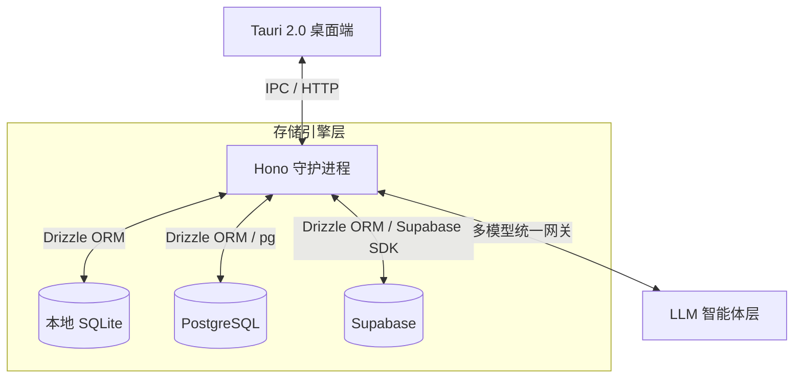

<div align="center">


# Jarvis

**个人 AI 智能控制中心**

安全、极速、多端同步的个人 AI 统一控制层。基于 Tauri 2.0 与 Hono 构建，整合对话、任务、阅读和记忆。

[](https://tauri.app/)
[](https://react.dev/)
[](https://www.typescriptlang.org/)
[](LICENSE)

[English](./README.md) | [简体中文](./README_zh.md)

</div>

---

## 愿景

Jarvis 不仅仅是 AI 助手，它是您数字生活的**统一大脑**。通过将 AI 工具调用能力与个人数据紧密绑定，Jarvis 将聊天、任务管理、阅读清单和复盘分析无缝贯通。

无论您偏好零配置、完全离线的**本地优先体验**，还是需要跨设备的**云端同步**，Jarvis 的动态数据库切换架构都能完美适配。

## 特性

**Tauri 2.0 桌面端** — 极致轻量，内存占用极低，完美原生系统集成。

**存储工厂三合一**
- 本地 SQLite — 零配置开箱即用，数据全本地归档
- 外接 Supabase — 一键开启多设备云同步
- 通用 PostgreSQL — 兼容 AWS RDS、Neon.tech、Aiven 或任何自托管实例

**无感热切换** — 实时切换数据库无需重启，支持一键自动迁移表结构。

**多模型流式引擎** — SSE 流式输出、上下文感知工具调用、自然语言解析。支持 DeepSeek、Kimi、OpenRouter 及任何 OpenAI 兼容提供商。

**模型广场** — 动态提供商注册，内置预设目录（OpenAI、Anthropic、Google、DeepSeek、Groq、Qwen、OpenRouter、Ollama），支持通过 UI 添加任意自定义端点。

## 架构



## 模块

| 模块 | 说明 |
|:---|:---|
| **对话** | 多模型流式交互，上下文记忆，自动工具调用。 |
| **任务** | 智能任务管理，支持优先级、到期日、标签、自然语言创建。 |
| **阅读** | 书籍/文章跟踪，AI 摘要，阅读进度记录。 |
| **复盘** | 每日/每周数据洞察，完成度分析，自动生成复盘报告。 |
| **数据库** | 存储控制面板 — 测试连通性、迁移表结构、热切换引擎。 |
| **模型** | 模型广场 — 管理提供商、发现模型、配置路由规则。 |

## 快速开始

### 前置要求

- Node.js >= 20.0.0
- pnpm >= 9.0.0
- Rust（最新稳定版，用于 Tauri 编译）

### 安装

```bash
git clone https://github.com/your-username/Jarvis.git
cd Jarvis
pnpm install
```

### 配置

在根目录创建 `.env` 文件（或复制 `.env.example`）：

```properties
AI_PROVIDER=deepseek
AI_MODEL=deepseek-chat
MIMO_API_KEY=your_key_here
DAEMON_PORT=3001
SQLITE_DB_PATH=./daemon/data/jarvis.db
```

### 启动

```bash
pnpm dev
```

同时拉起 Hono 守护进程与 Tauri 桌面端。

## 开发工具

解决 Windows 文件锁定问题（`os error 5: 拒绝访问`）：

```bash
pnpm clean:app     # 清理前端残留进程
pnpm clean:daemon   # 释放 3001 端口
pnpm clean:all      # 一键双清（推荐）
```

## 项目结构

```
Jarvis/
├── daemon/               # Node.js 后端 (Hono)
│   ├── src/
│   │   ├── api/          # REST API 路由
│   │   ├── db/           # 数据库持久层与仓储模式
│   │   ├── config/       # 环境校验与持久化配置
│   │   └── index.ts      # 入口文件
│   └── data/             # 本地 SQLite 存储目录
├── frontend/             # Tauri 2.0 桌面端 (Vite + React)
│   ├── src/
│   │   ├── components/   # UI 组件
│   │   ├── stores/       # Zustand 状态管理
│   │   └── main.tsx      # React 入口
│   ├── src-tauri/        # Rust 原生代码
│   │   ├── icons/        # 全平台适配图标
│   │   └── src/lib.rs    # Tauri 命令与窗口配置
│   └── public/           # 静态资源
└── package.json          # Monorepo 根配置
```

## 开源协议

[MIT](LICENSE)
